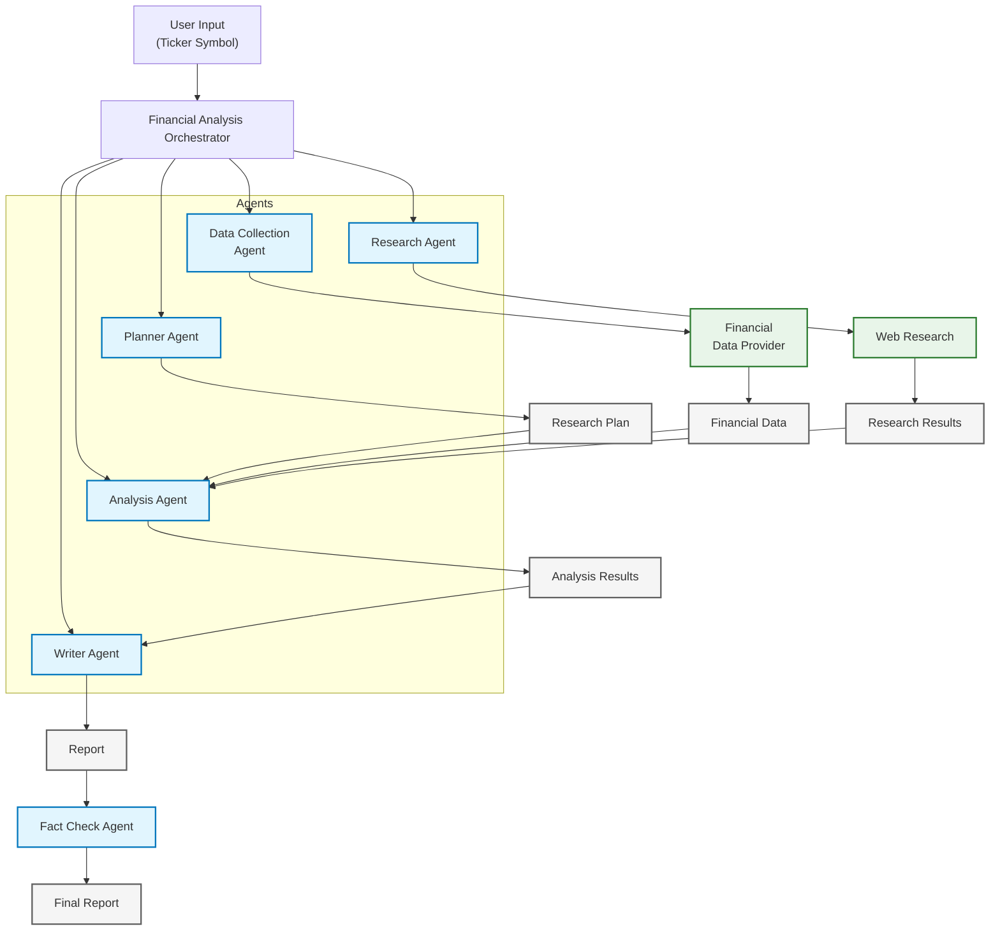

# System Architecture

The Financial Analysis System follows a modular architecture based on specialized agents that collaborate to produce financial analysis reports.

## High-Level Architecture

## Workflow

The system follows this workflow:

1. **Orchestrator** receives a ticker symbol and initializes the process
2. **Planner Agent** creates a research plan tailored to the company
3. **Data Collection Agent** gathers financial data based on the plan
4. **Research Agent** conducts web research on the company and industry
5. **Analysis Agent** processes financial data and integrates research insights
6. **Writer Agent** generates a comprehensive financial report
7. **Fact Check Agent** verifies the accuracy of the report
8. **Orchestrator** delivers the final report

## Agent Communication

Agents communicate by passing structured data objects. Each agent takes specific inputs and produces outputs that other agents can consume:

- **Planner Agent**: Takes ticker and company info, outputs research plan
- **Data Collection Agent**: Takes ticker and research plan, outputs financial data
- **Research Agent**: Takes ticker and company profile, outputs research results
- **Analysis Agent**: Takes financial data and research results, outputs analysis
- **Writer Agent**: Takes analysis results, outputs draft report
- **Fact Check Agent**: Takes draft report and data, outputs verified report

## Dependencies

The system relies on several external services and libraries:

- **Financial Data**: Financial Modeling Prep API
- **Web Research**: SerpAPI
- **Natural Language Processing**: OpenAI's LLM API
- **Data Processing**: Pandas and NumPy
