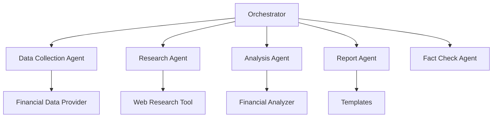

# System Architecture

The Financial Analysis Agent is built on a modular, multi-agent architecture designed for extensibility and maintainability.

## Core Components

## Data Flow

1. **Data Collection**: Financial statements, metrics, prices
2. **Research**: Market analysis, news, competitor data
3. **Analysis**: Integration and insight generation
4. **Reporting**: Report generation with citations
5. **Fact Checking**: Validation and verification

## Design Principles

- **Modularity**: Independent, specialized agents
- **Observability**: Comprehensive logging and tracing
- **Reliability**: Robust error handling and validation
- **Extensibility**: Easy to add new capabilities

For detailed information about each component, see:
- [Agent System](components/agent-system.md)
- [Citation System](components/citation-system.md)
