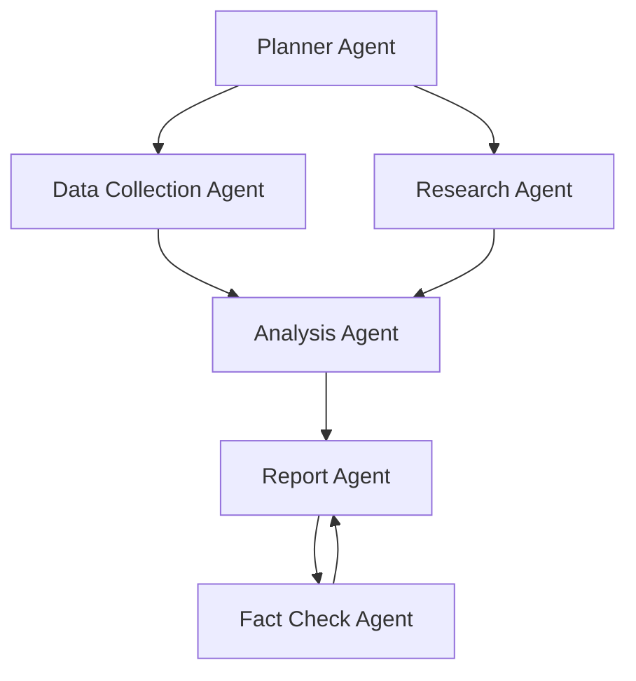

# Agent System Architecture

## Overview

The Financial Analysis Agent System uses a role-based architecture with specialized agents working together to perform comprehensive financial analysis. Each agent has specific responsibilities and expertise.

## Core Agents

### Planner Agent
- Creates comprehensive research plans
- Determines analysis requirements
- Structures the research approach

### Data Collection Agent
- Gathers financial data from APIs
- Collects historical market data
- Retrieves company information

### Research Agent
- Conducts web research
- Analyzes news and market sentiment
- Researches industry trends

### Analysis Agent
- Performs financial analysis
- Generates insights from data
- Integrates various data sources

### Report Agent
- Creates structured reports
- Formats analysis results
- Ensures clear communication

### Fact Check Agent
- Validates data accuracy
- Verifies citations
- Ensures report quality

## Agent Interaction Flow

## System Benefits

1. **Specialized Expertise**: Each agent focuses on specific tasks
2. **Quality Control**: Built-in validation and fact-checking
3. **Scalability**: Easy to add new agents or modify existing ones
4. **Maintainability**: Modular design for easy updates
